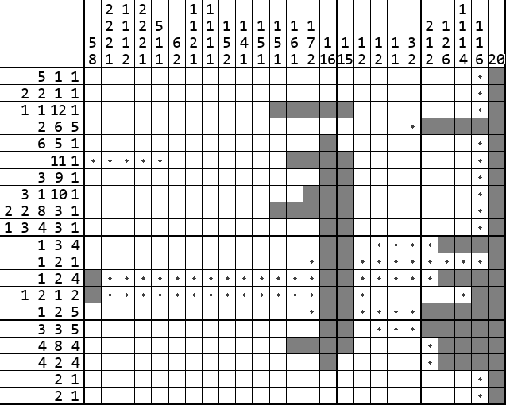
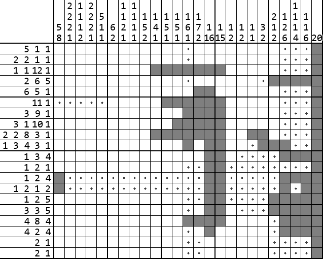
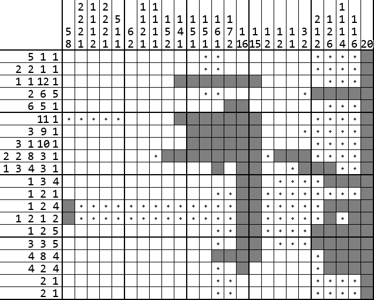

# Tester-obrazkow-logicznych
Prosty program do testowania narysowanych obrazków logicznych.

## Użycie
1. Przeciągnięcie obrazka na plik wykonywalny (domyślnie Obrazek_logiczny.exe).
2. Uruchomienie programu z konsoli (Pozwala to na modyfikację parametrów programu).

## Założenia
- Obrazek czarno-biały
- Wymiary muszą być wielokrotnością 5

## Biblioteki
- FreeImage
- FreeType

## Wymagania
- Visual Studio Version 16+

## Przykład
- Obrazek wejściowy:

- Obrazki wyjściowe:

